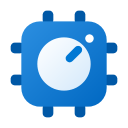
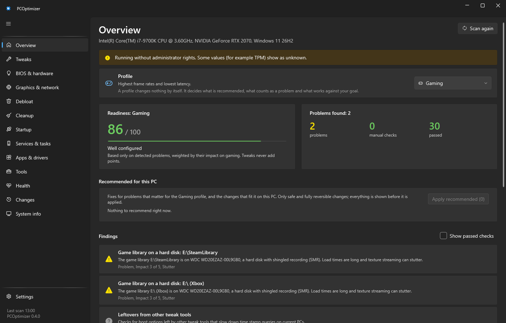
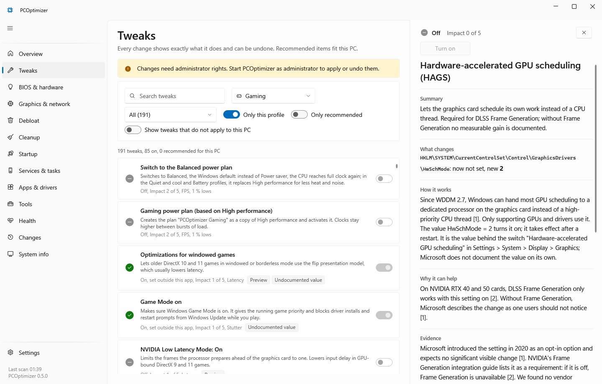

# PCOptimizer

A Windows 11 PC optimizer, gaming first, with profiles for laptops, battery, office, quiet and older PCs. It explains every finding and every change with sources, backs up what it changes and can undo it. A single exe for Windows 11 24H2 or newer, x64 only, in English and German.

> **Status: preview (0.4).** Apply and undo are tested against a registry sandbox and fake system interfaces, and parts of the [VM test plan](docs/vm-test-plan.md) have run on a Hyper-V VM ([results](docs/vm-test-results-2026-10-10.md)); the features added since then are not VM-tested yet. Tweaks marked **Preview** are the risky ones that most need that test. Create a restore point or a backup before you change anything, and start with the recommended items. Laptop profiles, battery checks and AMD-specific checks have not been checked on real hardware.

## Download

Get `PCOptimizer.exe` from the [Releases](https://github.com/jozuern/PCOptimizer/releases) page and compare its SHA-256 with the `.sha256` file next to it (`Get-FileHash PCOptimizer.exe`). The in-app update also checks the `.sig` signature file against the key built into the app. The exe asks for administrator rights because it changes system settings. It is not code signed yet, so Windows SmartScreen may warn on first start.

## What it does

- **Scan:** 48 read-only checks (problems, BIOS and hardware advice, game access per anti-cheat). Each comes with what was found, why it matters, how to fix it and sources, in English and German. A check that cannot read something says "unknown" and gives no advice.
- **Tweaks:** 211 catalog tweaks with gaming impact from 0 to 5, how solid the evidence is (situational or disputed), risk and sources, plus tweaks built for this PC: per-game NVIDIA profiles, MSI mode per device and interrupt affinity for the graphics card (Expert), startup entries, services, Windows features.
- **Profiles:** Gaming, Laptop gaming, Battery, Office, Quiet and cool, Older PC. A profile changes nothing by itself; it decides what "Apply recommended" includes and which impact is shown.
- **Apply recommended:** one confirmation for the fixes of detected problems and the tweaks that fit this PC, each with its reason. Expert, boot-critical, anti-cheat sensitive, Preview and not fully reversible items are never included.
- **Undo:** every change is backed up first (plus a restore point once per session), verified after applying and listed on the Changes page with Undo, also after a restart. After a Windows update the app lists changes Windows reset and offers to apply them again.
- **Privacy, browsers and Windows:** documented policies for Microsoft Edge, Google Chrome and Brave (data collection, AI features, promotions), Windows AI features (Recall, Paint, Notepad), app permissions, Windows Update, notifications, the taskbar and Start, and security options such as LSA protection and Defender network protection. Edge policies that Edge ignores in profiles signed in with a personal Microsoft account say so.
- **Graphics & network:** NVIDIA driver settings through the documented driver settings interface (NVAPI), VRR state, network adapter power saving, DNS presets and an opt-in DNS benchmark.
- **Debloat, cleanup, startup, services:** a reviewed list of 126 removable apps (inbox apps, older Microsoft apps, third-party promotions and manufacturer apps, with a warning on vendor update tools and an honest note when the Store no longer offers an app), 11 cleanup categories that never follow links, an Autoruns-style startup list with signature checks, service start types with explanations.
- **Tools and health:** storage analyzer, Windows features, Windows Update repair, SFC and DISM, a frame time benchmark with PresentMon, throttle check, drive health, opt-in sensors.

The app uses settings that Microsoft or the hardware vendor documents. A few harmless, fully reversible tweaks use a value Microsoft does not document (the value behind a Windows Settings switch, or a widely used one such as the classic right-click menu): they carry an "Undocumented value" badge, their explanation page says so, and they stay previews until a test has shown that the value works. It never recommends turning off security features that anti-cheats require, and keeps changes that weaken security or touch the boot configuration in Expert mode.

## Privacy

No telemetry, no accounts. The app goes online only for features you start or turn on (update check, VirusTotal lookup, DNS benchmark, app installs). Details: [docs/PRIVACY.md](docs/PRIVACY.md).

## FAQ

**Why is tweak X not included?** Many popular tweaks do nothing on Windows 11, use settings nobody documents, or cost more than they bring. [docs/not-included.md](docs/not-included.md) lists them with the reason and sources, including the ones earlier versions offered.

**What does "Preview" mean?** The tweak is risky enough that it needs testing on real Windows before it can be called safe, and that test has not been done yet. Apply it on its own, after a restore point, and check the result.

**Will it make my games faster?** Sometimes. The biggest gains come from fixing real problems the scan finds (a monitor at 60 Hz, memory without XMP, the wrong power plan). Most tweaks change little; each page says how solid the evidence is, and the benchmark on the Health page lets you measure your own games.

**Can I undo everything?** Every change the app makes is backed up and can be undone on the Changes page, also after a restart or an update of the app. Removing an inbox app cannot be undone by the app; the Store link stays where the Store still offers it.

**Does it work on Windows 11 Home?** Yes. Some Group Policy based tweaks only work on Pro, Enterprise or Education; the app does not offer them on Home.

**Why does it need administrator rights?** Most settings it changes are machine-wide. Its data folder (`%ProgramData%\PCOptimizer`) is locked to administrators, and links or files planted there by other accounts are removed before use.

## License

PCOptimizer is free for personal and other noncommercial use under the [PolyForm Strict License 1.0.0](LICENSE). Changing, redistributing or selling it requires the author's permission. It comes without warranty. Commercial use: ask via an issue.

The exe contains third-party components under their own licenses (MIT, BSD-2-Clause, MPL-2.0, Apache-2.0); the full texts are in the app under Settings > About > Licenses and listed in [docs/THIRD-PARTY-NOTICES.md](docs/THIRD-PARTY-NOTICES.md).

## Credits

PCOptimizer was built with the help of Claude, an AI assistant by Anthropic.

## Feedback and security

Bugs and ideas: open an issue. Security problems: see [SECURITY.md](SECURITY.md). Building from source and project layout: [CONTRIBUTING.md](CONTRIBUTING.md).
